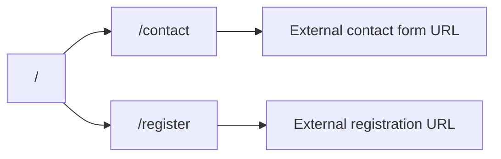

# Nubuaed: Home, Contact, Register

## Brand alignment (from guidelines)

- **Visual system**: High-contrast **black (`#000000`) on white (`#FFFFFF`)** for core UI; generous whitespace; centered, vertical-stack layouts. Avoid the current purple-gradient template look in [`src/components/Hero.tsx`](src/components/Hero.tsx)—it conflicts with “strict black-on-white; no secondary brand colors in the mark.”
- **Typography**: Switch primary UI type toward **bold geometric sans** per guidelines—e.g. **Montserrat** (700 for headings, 400/500 for body) via `next/font/google`, keeping a clear fallback stack aligned with [`docs/brand-guidelines.json`](docs/brand-guidelines.json) `latin.referenceFonts`.
- **Wordmark / Arabic**: Use [`public/logo.png`](public/logo.png) as the authoritative mark (`meta.sourceAsset`). Guidelines specify lowercase **“nubua”** and Arabic accent **نبُوَّة** with diacritics; the business name you gave is **nubuaed**. **Decision for copy**: use **“nubuaed”** in page titles and running text where it refers to the organization, and treat the **logo image** as the canonical visual for “nubua” if the asset still reads that way—optionally refresh [`docs/brand-guidelines.json`](docs/brand-guidelines.json) `meta` later so JSON matches the final name (no code dependency on the JSON file for rendering; it’s your design contract).
- **Accessibility**: Maintain focus-visible styles but retune from indigo to **neutral/black** focus rings to match the palette.

## Information architecture

## Routes and layout shell

| Route | Purpose |
|-------|---------|
| `/` | Marketing home: value prop, what you offer (kids’ Islamic learning), trust/safety note, CTAs |
| `/contact` | How to reach the org + **link or embed** to the client’s external contact form |
| `/register` | Enrollment explainer + **link or embed** to the client’s external registration form |

- Add a **shared shell**: header (logo + nav: Home, Contact, Register) and footer (short tagline, optional “est 2025” line from guidelines, copyright).
- Implement shell in a small set of components under `src/components/` (e.g. `SiteHeader`, `SiteFooter`) and wrap pages via [`src/app/layout.tsx`](src/app/layout.tsx) so navigation is consistent.
- Update **metadata** in [`src/app/layout.tsx`](src/app/layout.tsx) (title template, description, OpenGraph) from the generic “Next.js Beginner Template” to nubuaed + Islamic education for children.

## External forms (your choice)

- **Pattern**: Store **optional** public URLs in env, e.g. `NEXT_PUBLIC_CONTACT_FORM_URL` and `NEXT_PUBLIC_REGISTER_FORM_URL`, validated in [`src/lib/env.ts`](src/lib/env.ts) (extend the Zod schema; keep optional so the site still builds before the client pastes links).
- **UI behavior**:
  - If URL is set: show a primary button “Open form” and/or an **iframe embed** for Google Forms/Typeform (height + border, `title` for a11y). Many providers work better with **open in new tab** for mobile—use a **button link** as primary, embed as secondary when width allows.
  - If URL is missing: show a short message that the form link is coming soon and a mailto fallback only if you add a `NEXT_PUBLIC_CONTACT_EMAIL` (optional).

## Page content (copy direction)

- **Home**: Hero with logo, headline (e.g. Islamic learning for children), subtext (warm, professional), primary CTA → Register, secondary → Contact; optional sections: “What we teach” (Quran basics, adab, stories—placeholder bullets the client can edit), “Who it’s for” (age range placeholder), short reassurance (parent-friendly, culturally grounded per `themes.mood`).
- **Contact**: Heading, short intro, external form CTA/embed; optional static lines for location/hours if the client provides them later (constants in one file).
- **Register**: Heading, what parents should prepare (placeholder list), external registration CTA/embed.

## Styling / tokens

- Centralize brand colors in Tailwind v4 theme extension in [`src/app/globals.css`](src/app/globals.css) (`@theme`: `--color-brand-primary`, `--color-brand-background`, etc.) mirroring the JSON palette so prose/links/skip-link aren’t indigo by default.
- Replace body font wiring: today Geist is applied in [`src/app/layout.tsx`](src/app/layout.tsx); swap to Montserrat (and keep mono only if needed for code—likely unnecessary on a marketing site).

## Tests and quality

- Update [`src/components/Hero.test.tsx`](src/components/Hero.test.tsx) (or replace with tests for the new home sections) so Vitest still reflects the home page structure.
- No `npm`/`npx` from the agent per your rule—after implementation, **you** run your usual `/build` or `pnpm`/`npm` workflow locally to verify.

## Files to add or touch (concise)

- **Add**: `src/app/contact/page.tsx`, `src/app/register/page.tsx`, `src/components/SiteHeader.tsx`, `src/components/SiteFooter.tsx`, plus small section components for home if it keeps `page.tsx` readable.
- **Edit**: [`src/app/page.tsx`](src/app/page.tsx) (compose home), [`src/app/layout.tsx`](src/app/layout.tsx) (fonts, shell, metadata), [`src/app/globals.css`](src/app/globals.css) (theme + link/focus colors), [`src/lib/env.ts`](src/lib/env.ts) (optional form URLs), retire or heavily refactor [`src/components/Hero.tsx`](src/components/Hero.tsx).

## Client handoff checklist

- Provide two URLs: **contact form** and **registration form** (Google Forms, Typeform, etc.).
- Confirm final **organization name** for legal/footer vs logo (“nubua” vs “nubuaed”).
- Optional: single **contact email** for mailto fallback.
